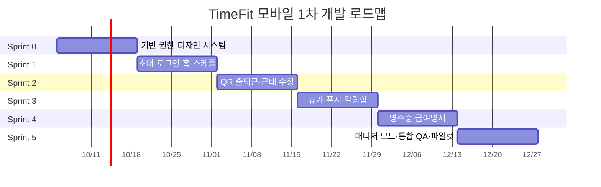

# TimeFit 모바일 앱 1차 개발 기획·설계 로드맵

작성일: 2026-09-30  
문서 상태: 개발 실행 기준안 v1.0  
개발 기간: 12주, 2주 단위 6개 스프린트  
대상: iOS·Android 직원/매니저 앱 P0  

관련 문서:

- `128-mobile-app-product-planning-design-2026-09-30.md`
- `129-mobile-app-phase2-role-based-product-design-2026-09-30.md`
- `130-mobile-app-toss-inspired-uiux-design-2026-09-30.md`
- `131-mobile-app-content-layout-alignment-spec-2026-09-30.md`

## 1. 결론

1차 개발은 TimeFit 관리자 웹을 모바일로 복제하는 프로젝트가 아니다. 직원과 현장 매니저가 매일 사용하는 핵심 흐름을 모바일에서 안전하게 완료하는 제품을 만든다.

12주 동안 다음 순서로 개발한다.

```text
기반·권한
→ 초대·로그인·직원 홈·스케줄
→ QR 출퇴근·근태 수정
→ 휴가·알림
→ 영수증·급여명세
→ 매니저 운영·통합 QA·파일럿 출시
```

첫 번째 기술·제품 마일스톤은 `초대 링크 → 로그인 → 사업장 확인 → 오늘 근무 → QR 출근 완료`의 수직 흐름이다. 화면만 먼저 다수 만드는 방식보다 인증, 권한, DB, 서버 시각, QR 보안, 상태 갱신, 분석 이벤트를 하나의 실제 흐름으로 완성한다.

## 2. 1차 목표

### 사용자 목표

- 직원은 오늘 근무를 확인하고 10초 안에 출퇴근을 기록한다.
- 직원은 휴가, 근태 수정, 영수증 제출 상태를 앱에서 추적한다.
- 직원은 공개된 본인 급여명세만 안전하게 확인한다.
- 매니저는 오늘 직원 상태와 휴가·근태 수정 요청을 모바일에서 처리한다.
- 다중 사업장·다중 역할 사용자에게 다른 조직의 정보가 섞이지 않는다.

### 사업 목표

- 메신저 기반 휴가·근태·증빙 업무를 앱 내 추적 가능한 상태로 전환한다.
- 출퇴근 누락과 승인 대기 시간을 줄인다.
- 관리자 웹, 태블릿 키오스크, 모바일 앱이 같은 원본 데이터를 사용한다.
- 2차 교대·대타·스케줄 편집 기능이 올라갈 수 있는 권한·알림·버전 기반을 마련한다.

### 기술 목표

- Flutter 단일 코드베이스로 iOS·Android를 지원한다.
- Supabase Auth, PostgreSQL, RLS, RPC/Edge Function을 운영 기준으로 사용한다.
- 직원 본인 범위와 매니저 담당 범위를 서버에서 강제한다.
- 중복 탭·네트워크 재시도에도 출퇴근·승인이 한 번만 반영된다.
- 앱 버전, 오류, 핵심 퍼널을 운영 환경에서 추적한다.

## 3. 개발 전제와 팀 구성

### 3.1 기준 팀

| 역할 | 권장 투입 | 주요 책임 |
|---|---:|---|
| 제품 기획/PO | 0.5~1명 | 범위, 정책, 수용 기준, 파일럿 운영 |
| Product Designer | 0.5~1명 | 컴포넌트, 화면, 프로토타입, 디자인 QA |
| Flutter 개발 | 2명 | 앱 셸, 기능, 기기 통합, 스토어 빌드 |
| Backend/Supabase | 1명 | 마이그레이션, RLS, RPC, 알림·업로드 |
| Web 개발 | 0.5명 | 초대, 관리자 연동, 승인·데이터 확인 |
| QA | 0.5명, 후반 1명 | 테스트 설계, 실기기, 회귀, 출시 판정 |

이 구성보다 인력이 적으면 기능을 병렬로 진행하지 않는다. Flutter 1명과 Backend 1명 기준으로는 같은 범위에 약 20~24주가 필요하다.

### 3.2 스프린트 운영

- 스프린트: 2주
- 계획: 첫날 범위·위험·수용 기준 확정
- 중간 점검: 1주차 종료 시 실제 기기 데모
- 디자인 QA: 기능 완료 전에 화면 단위 수행
- 스프린트 리뷰: 실제 운영 데이터 또는 격리 테스트 데이터로 시연
- 회고: 다음 스프린트에 반영할 변경만 기록

### 3.3 개발 환경

```text
local
├─ 로컬 Supabase 또는 격리 개발 프로젝트
├─ 테스트 사용자·사업장
└─ Flutter debug build

staging
├─ 운영과 같은 마이그레이션·RLS
├─ 테스트 푸시·스토리지
├─ 내부 배포 빌드
└─ 자동화 UAT

production
├─ 운영 Supabase
├─ 스토어 release build
├─ 단계적 기능 플래그
└─ 모니터링·감사 로그
```

개발·스테이징·운영의 Supabase URL, 공개 키, 딥링크, 푸시 설정을 분리한다. 서비스 역할 키와 서명 키는 앱에 포함하지 않는다.

## 4. 1차 범위 고정

### 4.1 반드시 포함

| Epic | 기능 | 직원 | 매니저 |
|---|---|---|---|
| E0 | 앱 기반·인증·사업장 전환 | 사용 | 사용 |
| E1 | 역할별 홈 | 개인 상태 | 운영 상태 |
| E2 | 개인 스케줄 | 조회 | 담당 직원 조회 |
| E3 | QR 출퇴근 | 기록·조회 | 현황 조회 |
| E4 | 근태 수정 | 요청·상태 | 승인·반려 |
| E5 | 휴가 | 잔여·신청·취소 | 승인·반려 |
| E6 | 영수증 | 촬영·업로드·상태 | 1차는 현황만 |
| E7 | 급여명세 | 공개 명세 조회 | 권한 없음 |
| E8 | 알림 | 푸시·알림함·딥링크 | 푸시·알림함 |
| E9 | 운영·보안 | 기기·세션·로그 | 감사·권한 |

### 4.2 조건부 포함

- 영수증 OCR 결과 확인: 기존 서버 처리 안정성이 확인되면 포함
- 급여 PDF 저장·공유: 조직 정책과 스토어 보안 검토 후 활성화
- 생체 인증: 기기 지원 여부에 따라 급여명세 재인증에 사용
- Realtime: 핵심 흐름은 수동 재조회로도 동작하게 한 뒤 보조 갱신으로 적용

### 4.3 2차로 분리

- 근무 가능시간·희망 휴무
- 교대·대타 요청
- 매니저 모바일 스케줄 생성·수정
- 승인 위임
- 영수증 수정 요청·모바일 승인
- 급여 전월 비교·구조화 문의
- 사업장 공지·읽음 확인
- 홈 위젯, 다크모드, 태블릿 2열
- 경영 요약·운영 인사이트

### 4.4 제외

- 모바일 급여 마감·수정
- 모바일 카드사 연결·월 결산
- 공용 태블릿 키오스크 모드 통합
- 오프라인 출퇴근 자동 확정
- GPS 상시 추적
- AI 자동 스케줄
- 직원 간 자유 채팅

## 5. 목표 아키텍처

### 5.1 저장소 구조

```text
time_fit/
├─ apps/
│  └─ mobile/                  # 신규 Flutter 앱
│     ├─ lib/
│     │  ├─ app/
│     │  ├─ presentation/
│     │  ├─ application/
│     │  ├─ domain/
│     │  └─ infrastructure/
│     ├─ test/
│     └─ integration_test/
├─ src/                        # 기존 관리자 웹
├─ pages/                      # Next.js 진입점/API 통합
├─ server/                     # 서버 라우트·도메인
├─ supabase/
│  ├─ migrations/
│  └─ functions/
└─ docs/
```

모바일 코드는 기존 `src/main.jsx`에 추가하지 않는다. Flutter 앱은 별도 `apps/mobile`에 두고, 관리자 웹과 Supabase 원본을 공유한다.

### 5.2 Flutter 계층

```text
Presentation
├─ Employee
├─ Manager
└─ Shared UI

Application
├─ Auth/Organization context
├─ Schedule
├─ Attendance
├─ Leave
├─ Receipt
├─ Payroll
└─ Notification

Domain
├─ Entity
├─ Policy
└─ Repository interface

Infrastructure
├─ Supabase client
├─ Secure storage
├─ Local cache
├─ Camera/QR
├─ Push
└─ Telemetry
```

Supabase 함수명이나 테이블명을 UI 코드에서 직접 사용하지 않는다. Infrastructure 저장소가 서버 계약을 앱 도메인 모델로 변환한다.

### 5.3 상태 소유 원칙

- 인증 세션은 앱 전체에서 한 곳이 소유한다.
- 현재 사업장·역할은 인증 컨텍스트와 분리하되 함께 검증한다.
- 화면 로컬 입력과 서버 원본 상태를 분리한다.
- 홈은 여러 기능 API를 직접 조합하지 않고 역할별 집계 응답을 사용한다.
- 캐시 키에는 사용자 ID, 조직 ID, 역할, 데이터 버전을 포함한다.
- 로그아웃·권한 해제 시 민감 캐시와 미제출 원본을 삭제한다.

## 6. 데이터·API 1차 범위

### 6.1 재사용

- 사용자·조직·멤버십·근무지
- 직원·고용 계약
- 스케줄
- 출퇴근 기록·QR 토큰
- 휴가 정책·잔여·요청
- 급여 실행·직원별 급여 항목
- 영수증·지출 증빙·스토리지
- 승인·감사 이력

### 6.2 신규 권장 데이터

#### 모바일 기기

`timefit_user_mobile_devices`

- 사용자, 플랫폼, 기기명
- 앱/OS 버전
- 푸시 토큰 해시와 공급자
- 마지막 사용 시각, 폐기 시각

#### 알림함

`timefit_user_notifications`

- 조직·사용자·이벤트 유형
- 대상 엔터티·딥링크
- 민감정보 없는 제목·본문
- 생성·읽음·만료 시각

#### 알림 설정

`timefit_user_notification_preferences`

- 스케줄·근태·승인·급여 알림 여부
- 출근 알림 시간
- 방해 금지 시간

#### 모바일 업로드 세션

`timefit_user_mobile_uploads`

- 업로드 종류와 상태
- 객체 경로·해시·멱등성 키
- 생성·만료 시각

### 6.3 1차 API/RPC

```text
GET  /mobile/bootstrap
GET  /mobile/home
GET  /mobile/schedules

POST /mobile/attendance/scan
GET  /mobile/attendance/records
POST /mobile/attendance/corrections

GET  /mobile/leave/summary
POST /mobile/leave/requests
POST /mobile/leave/requests/:id/cancel

POST /mobile/receipt-uploads
POST /mobile/receipts/:id/submit
GET  /mobile/receipts

GET  /mobile/payroll-statements
GET  /mobile/payroll-statements/:id

GET  /mobile/manager/staff-status
GET  /mobile/approvals
POST /mobile/approvals/:id/decision

POST /mobile/devices/register
GET  /mobile/notifications
POST /mobile/notifications/:id/read
```

현재 Supabase RPC를 직접 사용할 경우에도 동일한 앱 도메인 계약을 유지한다.

### 6.4 공통 계약

- 모든 변경 요청은 `idempotencyKey`를 받는다.
- 변경 가능한 원본은 `expectedVersion` 또는 `updatedAt`을 검증한다.
- 날짜·시간은 ISO 8601, 화면은 사업장 시간대로 표시한다.
- 출퇴근 확정은 서버 시각을 사용한다.
- 오류 응답에는 사용자 문구용 분류 코드와 운영 추적 ID를 포함한다.
- 목록은 커서 페이지네이션을 사용한다.
- 서명 URL은 짧은 만료시간을 사용한다.

## 7. 12주 개발 일정



날짜는 2026-10-05 착수 가정이다. 실제 착수일이 바뀌면 2주 단위 순서는 유지하고 달력 날짜만 이동한다.

## 8. Sprint 0 — 기반·권한·디자인 시스템

기간: 1~2주  
목표: 기능 개발이 반복해서 사용할 앱·서버·디자인 기반을 완성한다.

### 모바일

- `apps/mobile` Flutter 프로젝트 생성
- local/staging/production flavor
- 앱 라우팅, 의존성 주입, 네트워크·저장소 공통 모듈
- Supabase Auth 세션 복원·로그아웃
- Secure Storage
- 오류·로딩·빈 상태 공통 모델
- 네트워크 상태와 마지막 정상값 표시 기반
- 앱 버전·빌드 번호·원격 설정

### 디자인

- semantic color, typography, spacing, radius 토큰
- 공통 `PageScaffold`, `AppBar`, `Section`, `ActionRow`
- `PrimaryCTA`, `StatusChip`, `BottomSheet`
- Skeleton, Empty, Error, Toast
- 좌우 20dp·4pt 그리드와 큰 글자 대응
- 직원·매니저 하단 내비게이션 셸

### 백엔드

- 모바일 bootstrap 응답 계약 확정
- 조직·역할·직원 연결 검증
- 모바일 기기·알림·알림 설정 마이그레이션 초안
- RLS 권한 매트릭스 테스트
- 개발·스테이징 데이터 시드
- 멱등성 키 저장·검증 방식 확정

### 개발 운영

- Flutter analyze/test/build CI
- 마이그레이션 정적 검사와 격리 DB 테스트
- 코드 서명·스토어 계정 준비 목록
- 오류 추적·분석 도구 환경 분리
- 개인정보가 로그에 들어가지 않는 로깅 규칙

### 완료 기준

- 앱을 재실행해도 유효 세션이 복원된다.
- 로그인 사용자의 조직·역할·직원 연결이 bootstrap에서 반환된다.
- 역할이 없는 사용자는 데이터 화면에 진입하지 못한다.
- 공통 컴포넌트가 320dp와 글자 200%에서 동작한다.
- debug와 staging Android/iOS 빌드가 CI에서 성공한다.

### 마일스톤 M0

`로그인 → 사업장 컨텍스트 로드 → 역할별 빈 홈` 동작

## 9. Sprint 1 — 초대·로그인·직원 홈·스케줄

기간: 3~4주  
목표: 직원이 초대를 수락하고 오늘과 앞으로의 근무를 확인한다.

### 모바일

- 초대 딥링크 수신
- 기존 계정 로그인·신규 가입 연결
- 초대 상태: 유효, 만료, 취소, 이미 수락
- 사업장·역할 전환
- 직원 홈 헤더와 오늘 근무 상태
- 빠른 행동 진입점
- 주간 스케줄 목록
- 월간 스케줄 날짜 요약
- 근무 상세와 게시 상태
- 로컬 읽기 캐시·마지막 동기화 시각

### 백엔드

- 초대 조회·수락의 모바일 딥링크 계약
- `/mobile/bootstrap`
- `/mobile/home`
- 스케줄 기간 조회
- 직원에게 게시된 스케줄만 반환하는 RLS
- 다른 직원·조직 스케줄 접근 거부 테스트

### 관리자 웹

- 모바일 초대 링크 생성·복사·재발송
- 초대 대상 역할·사업장 확인
- 초대 상태 확인

### 디자인·QA

- 홈의 결론→근거→행동 순서 검증
- 긴 사업장명·이름·근무 유형
- 일정 없음, 휴무, 휴가, 변경, 로딩, 오류
- 뒤로가기와 사업장 전환 시 화면·캐시 분리

### 완료 기준

- 신규 사용자가 초대 링크에서 2분 안에 홈에 도착한다.
- 직원은 본인의 게시된 스케줄만 확인한다.
- 마지막 정상 스케줄을 오프라인에서 기준 시각과 함께 읽을 수 있다.
- 사업장 전환 후 이전 사업장 데이터가 남지 않는다.

### 마일스톤 M1

`초대 수락 → 직원 홈 → 주간 스케줄 상세` 내부 알파

## 10. Sprint 2 — QR 출퇴근·근태 수정

기간: 5~6주  
목표: 첫 번째 핵심 수직 흐름을 운영 데이터로 완성한다.

### 모바일

- QR 카메라 권한 사전 안내
- QR 스캔·손전등·권한 설정 이동
- 출근·퇴근 확인
- 저장 중 중복 탭 방지
- 성공 결과: 서버 시각, 근무지, 상태
- 오늘·주간·월간 개인 근태 기록
- 예정과 실제 비교
- 수정 요청: 대상 시각, 사유, 선택 첨부
- pending·approved·rejected 상태

### 백엔드

- QR 서명·사업장·만료·nonce 검증
- 로그인 사용자와 직원 프로필 연결
- 중복 출근·퇴근 방지
- 서버 시각 확정과 기기 시각 차이 기록
- 스케줄 없는 출근 보류 정책
- 출퇴근 수정 요청 생성·조회
- 출퇴근·요청 감사 로그
- 멱등성 통합 테스트

### 관리자 웹

- 모바일 출퇴근 출처 표시
- 보류 출근과 수정 요청 조회
- 기존 근태 승인 흐름과 상태 일치 확인

### QA

- 카메라 허용·거부·제한
- 만료 QR, 다른 사업장 QR, 위조 QR
- 네트워크 끊김·복구
- 앱 백그라운드·강제 종료·재실행
- 동일 요청 반복, 두 기기 동시 출근
- 야간·자정 경과 근무

### 완료 기준

- 정상 QR 출퇴근 성공률이 스테이징 반복 시험에서 98% 이상이다.
- 출퇴근 중앙값이 10초 이내다.
- 네트워크가 없으면 성공으로 표시하지 않는다.
- 같은 출퇴근이 두 번 생성되지 않는다.
- 앱과 관리자 웹에 같은 서버 시각과 상태가 표시된다.

### 마일스톤 M2

`초대 수락 → 홈 → QR 출근 → 기록 조회 → 관리자 확인` 수직 슬라이스 완료

## 11. Sprint 3 — 휴가·푸시·알림함

기간: 7~8주  
목표: 직원 요청과 관리자 결과가 푸시·딥링크까지 연결된다.

### 모바일

- 휴가 잔여·발생·사용·승인 대기 구분
- 유형·날짜·시간 선택
- 공휴일·정기휴일·중복·잔여 검증
- 최종 요약과 신청
- 처리 전 취소
- 승인·반려 결과와 반려 사유
- 기기 등록과 푸시 토큰 갱신
- 알림함 목록·읽음
- 휴가·근태·스케줄 딥링크
- 알림 설정·방해 금지 시간의 최소 UI

### 백엔드

- 휴가 요약·신청·취소 RPC
- 신청과 알림 이벤트 생성 트랜잭션
- 관리자 승인 결과 알림
- 모바일 기기 등록·폐기
- 푸시 발송 워커·재시도·중복 방지
- 알림함과 읽음 상태
- 잠금화면 안전 문구

### 매니저 최소 기능

- 알림에서 휴가·근태 요청 상세 진입
- 승인·반려
- 결과 최신화

### QA

- 푸시 토큰 회전·만료·중복 기기
- 앱 종료·로그아웃 상태 딥링크
- 다른 사업장 알림 수신 차단
- 휴가 동시 신청·승인 충돌
- 휴가 잔여 트랜잭션

### 완료 기준

- 휴가 신청 완료율이 UAT에서 90% 이상이다.
- 푸시에서 정확한 사업장과 요청 상세로 이동한다.
- 같은 이벤트가 중복 발송되지 않는다.
- 푸시 본문에 급여, 휴가 사유, 전화번호가 포함되지 않는다.
- 승인 결과가 직원 앱과 관리자 웹에서 동일하다.

### 마일스톤 M3

직원 요청과 매니저 결정이 알림까지 이어지는 폐쇄 루프 완료

## 12. Sprint 4 — 영수증·급여명세

기간: 9~10주  
목표: 직원의 증빙 제출과 민감 급여 조회를 안전하게 제공한다.

### 영수증 모바일

- 카메라 촬영·앨범 선택
- 자동 회전·자르기 또는 서버 처리 연결
- 흐림·반사·금액 잘림·해상도 화질 검사
- 여러 장 원본
- 부서·섹션, 결제수단, 지출 목적
- 암호화 임시 저장
- 업로드 진행·백그라운드 재시도
- 처리 중·확인 필요·검토 중·완료·실패 상태
- 제출 내역과 상세

### 급여명세 모바일

- 공개 급여 실행 목록
- 귀속월, 지급일, 실지급액
- 기본급·수당·공제·근무시간 근거 요약
- 생체 인증 또는 기기 자격 증명 재확인
- 미공개 상태의 안전한 문구
- PDF 보기·공유 기능 플래그

### 백엔드

- 업로드 세션·만료·멱등성
- 서명 업로드·다운로드 URL
- 파일 해시·중복·용량·MIME 검증
- 영수증 원본과 처리 상태 조회
- 기존 OCR·카드 매칭 파이프라인 연결
- 직원 본인의 공개 급여 항목만 반환
- 급여·원본 파일의 짧은 만료 서명 URL

### 관리자 웹

- 모바일 제출 출처와 상태
- 업로드 실패·OCR 실패·직원 확인 필요 필터
- 공개 급여 상태와 앱 노출 여부 확인

### QA

- 저조도·긴 영수증·다중 이미지·HEIC
- 앱 종료·네트워크 전환 중 업로드
- 중복 제출과 로그아웃 시 임시 원본 삭제
- 다른 직원 급여 URL 접근 차단
- 스크린샷·공유 정책 확인

### 완료 기준

- 영수증 촬영부터 제출 중앙값이 30초 이내다.
- 업로드 재시도로 중복 문서가 생성되지 않는다.
- 직원은 본인의 공개 급여명세만 조회한다.
- 로그와 오류 추적에 영수증 원본·급여 금액이 포함되지 않는다.
- 이미지 실패 시에도 제출 상태와 재시도 행동을 확인할 수 있다.

### 마일스톤 M4

직원 P0 기능 완성: 스케줄·출퇴근·휴가·영수증·급여명세

## 13. Sprint 5 — 매니저 모드·통합 QA·파일럿

기간: 11~12주  
목표: 현장 매니저 P0와 출시 품질을 완성하고 제한된 사업장에 배포한다.

### 매니저 모바일

- 오늘 운영 결론
- 근무 중·예정·지각·미출근·퇴근 누락
- 담당 직원 필터
- 휴가·근태 수정 통합 승인함
- 요청 상세: 원본, 요청값, 스케줄, 잔여, 이력
- 승인·반려와 사유
- 이미 다른 관리자가 처리한 충돌 상태
- 관리자 웹 딥링크

### 통합 품질

- 전체 역할·사업장 RLS 교차 테스트
- 320dp, 대표 iOS·Android, 큰 글자 200%
- VoiceOver·TalkBack 핵심 흐름
- 오프라인·저속망·백그라운드·강제 종료
- 메모리·배터리·카메라 장시간 사용
- 앱 시작·홈·목록 성능
- 개인정보·로그·서명 URL 검토
- 스토어 개인정보 고지·권한 문구

### 파일럿

- 1차 내부 알파: 운영자 5명 이하
- 2차 폐쇄 파일럿: 2~3개 사업장, 직원 20~50명
- 실제 출퇴근과 기존 태블릿·웹 기록 대조
- 문의 유형·실패 이유·완료시간 수집
- 심각도 P0/P1 결함 수정

### 완료 기준

- 매니저가 첫 처리 대상을 5초 안에 찾는다.
- 휴가·근태 승인 중앙 처리시간이 30초 이내다.
- 다른 사업장·직원·민감 데이터 노출이 0건이다.
- P0 결함 0건, P1 결함에 우회 경로와 수정 일정이 있다.
- 앱 비정상 종료 없는 세션이 99.7% 이상이다.
- 출퇴근 성공률, 푸시 딥링크, 휴가 완료율이 출시 게이트를 충족한다.

### 마일스톤 M5

스토어 제출 가능한 Release Candidate와 폐쇄 파일럿 결과

## 14. 병렬 작업 계획

| 스프린트 | Flutter A | Flutter B | Backend | Web | Design/QA |
|---|---|---|---|---|---|
| S0 | 앱 셸·인증 | 디자인 시스템 | bootstrap·RLS | 초대 계약 점검 | 토큰·공통 상태 |
| S1 | 초대·홈 | 스케줄·캐시 | 홈·스케줄 API | 초대 UI | 직원 UAT |
| S2 | QR·카메라 | 근태·수정 요청 | 출퇴근 RPC·감사 | 기록 연동 | 실기기·보안 |
| S3 | 휴가 | 푸시·알림함 | 휴가·알림 워커 | 승인 연결 | 딥링크 UAT |
| S4 | 영수증 | 급여명세 | 업로드·급여 RLS | 상태 확인 | 이미지·민감정보 QA |
| S5 | 매니저 홈 | 승인함·안정화 | 집계·충돌·모니터링 | 회귀 수정 | 통합 QA·파일럿 |

병렬 개발은 API 계약과 목업 응답을 먼저 고정한 뒤 진행한다. 한 역할의 완료가 다른 역할의 서버 구현을 기다리지 않도록 스테이징 mock과 contract test를 사용한다.

## 15. Critical Path

```text
조직·역할·직원 연결
→ 모바일 bootstrap
→ 초대·로그인
→ 오늘 근무·스케줄
→ QR 출퇴근 RPC
→ 서버 시각·멱등성·감사 로그
→ 직원 기록·관리자 확인
→ 푸시·딥링크
→ 매니저 승인
→ 통합 RLS·실기기 QA
→ 파일럿·스토어 제출
```

다음 작업은 Critical Path와 분리해 병렬 진행할 수 있다.

- 디자인 토큰과 공통 컴포넌트
- 영수증 촬영 UI
- 급여명세 읽기 UI
- 알림함 목록 UI
- 테스트 데이터와 자동화 시나리오

## 16. 우선순위 규칙

### P0

- 데이터 유출·권한 우회
- 출퇴근 중복·누락·잘못된 사업장 기록
- 휴가 잔여·승인 정합성
- 급여명세 다른 직원 접근
- 앱 실행·로그인 불가
- 업로드 원본 유실

### P1

- 핵심 흐름을 막지만 안전한 우회가 있는 오류
- 푸시 미수신이나 딥링크 실패
- 큰 글자·주요 기기 레이아웃 파손
- 상태가 늦게 갱신되지만 원본은 안전한 문제

### P2

- 애니메이션·미세 정렬
- 비핵심 빈 상태 문구
- 출시를 막지 않는 성능·편의 개선

스프린트 후반에 P0가 남아 있으면 새 기능 개발을 중단한다.

## 17. Definition of Ready

개발 시작 조건:

- 사용자와 해결할 문제가 한 문장으로 정의됨
- 정상·빈 상태·오류·권한·오프라인 상태가 정의됨
- API 입력·출력·오류·멱등성이 합의됨
- RLS 대상과 감사 로그가 정의됨
- UI 시안과 텍스트·이미지 정렬 기준이 준비됨
- 분석 이벤트와 성공 지표가 정의됨
- UAT와 완료 기준이 작성됨

조건이 부족한 기능은 스프린트에 넣지 않는다.

## 18. Definition of Done

기능 완료 조건:

- 정상 흐름과 주요 예외가 실제 스테이징 데이터로 동작
- 직원·매니저·다른 조직의 권한 테스트 통과
- 단위·위젯·통합 테스트 추가
- 로딩·빈 상태·오류·재시도·오프라인 처리
- 320dp와 큰 글자 200% 확인
- 화면 읽기 라벨과 초점 순서 확인
- 분석 이벤트와 운영 추적 ID 기록
- 개인정보가 로그·푸시·분석에 없는지 확인
- 관리자 웹·태블릿과 상태 일치 확인
- 제품·디자인·QA 수용 기준 승인

## 19. 테스트 전략

### 19.1 자동 테스트

| 계층 | 대상 |
|---|---|
| Domain unit | 시간 계산, 상태 매핑, 금액·날짜 표현 |
| Repository | API 응답·오류 변환, 캐시 분리 |
| Widget | 홈 상태, 폼 검증, 큰 글자, 권한별 메뉴 |
| Integration | 초대, 출퇴근, 휴가, 업로드, 승인 |
| SQL/RLS | 본인·담당·타 조직 접근 허용/차단 |
| Contract | 모바일 모델과 API 응답 호환 |

### 19.2 필수 E2E

1. 초대 수락·로그인·사업장 진입
2. 오늘 근무 확인·QR 출근·QR 퇴근
3. 근태 수정 요청·매니저 승인·직원 결과 확인
4. 휴가 신청·매니저 승인·스케줄 반영
5. 영수증 촬영·재시도·제출 상태
6. 공개 급여명세 조회·재인증
7. 다중 사업장·역할 전환
8. 권한 회수·로그아웃·분실 기기 폐기

### 19.3 기기 매트릭스

- 소형 Android 320~360dp
- 일반 Android 360~430dp
- 저사양 Android 실기기
- 소형 iPhone
- 일반·대형 iPhone
- 카메라 권한 제한 기기
- 시스템 글자 100%, 150%, 200%
- 라이트 모드 우선, 다크 모드는 의미 손상 여부만 사전 점검

최소 OS는 파일럿 대상 기기 분포를 확인해 Sprint 0에 확정한다.

## 20. 보안 체크포인트

- Supabase 세션은 Secure Storage에 저장
- service role, 푸시 서명 키, QR 서명 키는 앱에 포함하지 않음
- RLS에 조직·직원 본인·담당 사업장 조건 적용
- QR은 서명·만료·nonce·사업장을 검증
- 급여·영수증 파일은 짧은 만료 서명 URL
- 푸시 본문에 급여 금액·휴가 사유·전화번호 없음
- 로그·분석에 이미지·민감 필드 없음
- 로그아웃·퇴사·분실 시 기기와 푸시 토큰 폐기
- 관리자 결정과 원본 변경은 감사 로그 기록
- 앱 화면 숨김이 아닌 서버 권한으로 차단

출시 전 직원·매니저·총관리자·타 조직 계정으로 교차 접근 시험을 별도 수행한다.

## 21. 성능 기준

| 항목 | 목표 |
|---|---:|
| 앱 첫 실행 | 3초 이내 홈 셸 표시 |
| 세션 복원 | 2초 이내 마지막 안전 화면 |
| 홈 정상 응답 | p95 1.5초 이내 |
| QR 인식 후 결과 | p95 2초 이내 |
| 목록 스크롤 | 체감 끊김 없음 |
| 영수증 업로드 | 진행률과 재시도 제공 |
| 앱 용량 | Sprint 0에서 예산 확정, 스프린트별 추적 |

네트워크 지연 시 빈 화면 대신 스켈레톤 또는 마지막 정상값을 보여준다. 성능 목표를 위해 권한이나 데이터 최신성을 생략하지 않는다.

## 22. 분석 이벤트

```text
invite_opened
invite_accepted
onboarding_completed
organization_switched
home_viewed
schedule_opened
attendance_scan_started
attendance_completed
attendance_failed
attendance_correction_submitted
leave_started
leave_submitted
leave_cancelled
receipt_capture_started
receipt_submitted
receipt_retry_succeeded
payroll_statement_opened
approval_opened
approval_decided
push_received
push_opened
```

공통 속성:

- 앱 버전
- 플랫폼·OS 범주
- 활성 역할
- 기능 상태
- 소요시간
- 오류 분류

사용자 이름, 전화번호, 급여 금액, 휴가 사유, 영수증 내용은 전송하지 않는다.

## 23. 출시 지표

| 지표 | 출시 게이트 | 출시 후 8주 목표 |
|---|---:|---:|
| 온보딩 완료율 | 80% 이상 | 85% 이상 |
| QR 출퇴근 성공률 | 98% 이상 | 98% 이상 |
| 출퇴근 중앙시간 | 12초 이내 | 10초 이내 |
| 휴가 신청 완료율 | 85% 이상 | 90% 이상 |
| 영수증 제출 중앙시간 | 40초 이내 | 30초 이내 |
| 푸시 딥링크 정상 도착 | 99% 이상 | 99% 이상 |
| 비정상 종료 없는 세션 | 99.5% 이상 | 99.7% 이상 |
| 권한 밖 정보 노출 | 0건 | 0건 |

출시 후 목표에 미달하면 2차 기능을 시작하기 전에 원인을 개선한다.

## 24. 위험과 대응

| 위험 | 영향 | 조기 신호 | 대응 |
|---|---|---|---|
| 기존 DB 명칭·상태 불일치 | 앱·웹 결과 다름 | 같은 요청의 화면 상태 차이 | 계약 테스트와 상태 매핑표 고정 |
| 모바일 소스 부재 | 초기 일정 지연 | 기반 작업이 2주를 넘김 | Sprint 0 범위 고정, 템플릿 최소화 |
| QR 보안·중복 | 근태 신뢰 훼손 | 두 기기 중복 기록 | 서버 시각·nonce·멱등성·트랜잭션 |
| 푸시 신뢰성 | 승인 지연 | 토큰 오류·딥링크 실패 | 알림함을 원본으로 두고 푸시는 보조 |
| 영수증 대용량 | 업로드 실패·비용 증가 | 저속망 실패율 증가 | 압축·세션 업로드·백그라운드 재시도 |
| 급여 권한 오류 | 고위험 개인정보 사고 | RLS 교차 테스트 실패 | 서버 필드 최소화·재인증·보안 게이트 |
| 범위 확장 | 일정 지연 | 2차 기능이 스프린트에 유입 | 범위 고정표와 변경 승인 절차 |
| 스토어 심사 | 출시일 불확실 | 권한 문구·개인정보 이슈 | Sprint 0 준비, Sprint 5 전 제출 후보 |
| 파일럿 기기 편차 | 현장 사용 실패 | 카메라·글자·저사양 오류 | 실제 사업장 기기 목록을 Sprint 0 확보 |

## 25. 범위 변경 절차

새 기능을 1차 범위에 넣으려면 다음을 모두 충족해야 한다.

1. 사용자 또는 보안상 출시 필수임을 증명한다.
2. 같은 크기의 기존 범위를 1차에서 제거한다.
3. API·권한·QA 영향이 분석됐다.
4. PO, 기술 책임자, QA가 변경을 승인했다.
5. 출시 지표와 일정이 다시 계산됐다.

교대·대타, 공지, 모바일 스케줄 편집은 요구가 있어도 2차 백로그로 유지한다.

## 26. 배포 전략

### 단계 0 — 개발 내부

- 개발자·기획·디자인 계정
- 격리 테스트 사업장
- 실제 급여·개인정보 사용 금지

### 단계 1 — 내부 알파

- 운영자 5명 이하
- 초대·스케줄·출퇴근·푸시 집중
- 매일 오류·성공률 검토

### 단계 2 — 폐쇄 파일럿

- 2~3개 사업장
- 직원 20~50명
- 기존 태블릿·웹과 병행
- 출퇴근과 휴가 원본 대조

### 단계 3 — 단계적 출시

- 기능 플래그로 사업장 단위 활성화
- 첫 그룹 10%
- 48시간 이상 P0·지표 확인 후 50%
- 다시 확인 후 100%

### 중단·복구

- 모바일 QR 출퇴근 플래그 비활성화
- 태블릿·관리자 웹 경로 유지
- 푸시 중단 시 알림함과 웹 승인 사용
- 앱 버전 문제 시 최소 지원 버전·업데이트 안내
- DB 마이그레이션은 하위 호환 후 단계적으로 제거

## 27. 출시 체크리스트

### 제품

- P0 범위와 제외 기능이 앱 내에서도 일치
- 모든 주요 상태 문구 검수
- 고객지원·개인정보·권한 안내 준비

### 기술

- production 환경 변수·서명·푸시 인증서
- 마이그레이션·RLS·Edge Function 적용
- 백업·모니터링·오류 알림
- 최소 지원 버전·점검 모드

### 품질

- P0 0건
- P1 우회 경로와 수정 일정
- 필수 E2E 8개 통과
- 접근성·실기기·저속망 통과

### 운영

- 파일럿 사업장 담당자
- 분실 기기 세션 폐기 절차
- 출퇴근 분쟁·정정 대응 절차
- 스토어 문의·장애 공지 템플릿

## 28. 1차 출시 판정

다음 조건을 모두 만족해야 출시한다.

1. 직원 P0 흐름인 스케줄, 출퇴근, 휴가, 영수증, 급여명세가 운영 원본과 연결된다.
2. 매니저가 휴가·근태 수정 요청을 담당 범위에서 처리한다.
3. 타 직원·타 조직·권한 밖 급여·재무 정보 접근이 차단된다.
4. 출퇴근·승인·업로드가 중복 요청에도 한 번만 반영된다.
5. 주요 실기기, 320dp, 글자 200%, 화면 읽기 핵심 흐름이 통과한다.
6. 출시 게이트 지표를 파일럿에서 충족한다.
7. P0 결함이 0건이다.
8. 기존 태블릿·관리자 웹의 운영 흐름이 깨지지 않는다.

하나라도 충족하지 못하면 스토어 배포 비율을 확대하지 않는다.

## 29. 착수 후 첫 5영업일

### Day 1

- P0 범위·제외 범위 서명
- 역할·사업장·직원 연결 원본 확인
- 파일럿 후보 사업장과 기기 목록 요청

### Day 2

- Flutter 프로젝트와 환경 flavor 생성
- 모바일 bootstrap API 계약 리뷰
- 디자인 토큰을 Flutter semantic token으로 변환

### Day 3

- 인증 세션·Secure Storage 구현
- 스테이징 Supabase·테스트 사용자 준비
- CI에서 analyze/test/build 실행

### Day 4

- 빈 역할 홈과 사업장 전환
- RLS 직원·매니저·타 조직 테스트
- 초대 딥링크 계약 확정

### Day 5

- 실제 기기에서 로그인·세션 복원 데모
- Sprint 0 위험 검토
- M0까지 남은 작업 재산정

## 30. 로드맵 완료 후 2차 진입 조건

2차 기능 개발은 다음을 모두 만족한 뒤 시작한다.

- QR 출퇴근 성공률 98% 이상
- 푸시 딥링크 정상 도착률 99% 이상
- 앱 비정상 종료 없는 세션 99.7% 이상
- 휴가 신청 완료율 90% 이상
- 권한 밖 정보 노출 0건
- 2개 이상 실제 사업장에서 4주 운영
- P0 미해결 0건
- 가장 많이 발생한 P1 문의와 오류 원인 분석 완료

조건 충족 후 `129-mobile-app-phase2-role-based-product-design-2026-09-30.md`의 가능시간·교대·스케줄 편집을 우선 개발한다.

