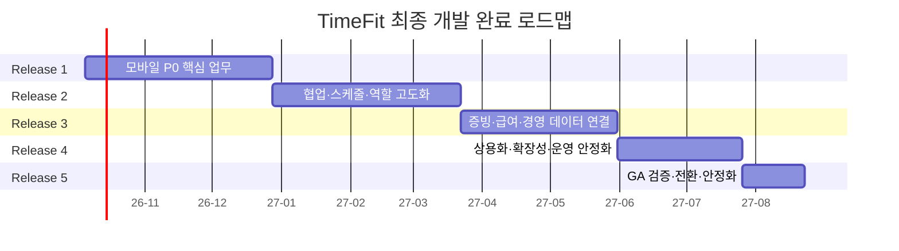

# TimeFit 최종 개발 완료 마스터 로드맵

작성일: 2026-09-30  
문서 상태: 통합 실행 기준안 v1.0  
전체 예상 기간: 46주  
착수 가정일: 2026-10-05  
최종 완료 목표일: 2027-08-22  
최종 목표 버전: TimeFit v2.0 GA

관련 기준 문서:

- `128-mobile-app-product-planning-design-2026-09-30.md`
- `129-mobile-app-phase2-role-based-product-design-2026-09-30.md`
- `130-mobile-app-toss-inspired-uiux-design-2026-09-30.md`
- `131-mobile-app-content-layout-alignment-spec-2026-09-30.md`
- `132-mobile-app-phase1-development-roadmap-2026-09-30.md`

## 1. 최종 결론

TimeFit의 최종 개발 완료는 단순히 모바일 화면이 모두 구현된 상태가 아니다. 직원·매니저·총관리자가 모바일, 관리자 웹, 태블릿 키오스크에서 같은 원본 데이터를 사용하고, 출퇴근·스케줄·휴가·급여·증빙·운영 업무가 권한과 감사 이력을 유지한 채 끝까지 완료되는 상용 운영 상태를 의미한다.

전체 개발을 다음 5개 릴리스로 진행한다.

```text
Release 1 — 모바일 핵심 업무
Release 2 — 스케줄 협업과 역할별 운영
Release 3 — 증빙·급여·경영 데이터 연결
Release 4 — 상용화·확장성·운영 안정화
Release 5 — 최종 GA 검증과 전환
```

최종 완료 경계는 `v2.0 GA`로 고정한다. AI 자동 스케줄 확정, 직원 자유 채팅, 전자계약, 교육·복지 플랫폼은 핵심 제품 완료 후 별도 제품 검증을 거쳐 진행하며 v2.0 완료를 막지 않는다.

## 2. 최종 제품 범위

### 2.1 직원

- 초대·가입·로그인·사업장 전환
- 오늘 근무와 변경 확인
- QR 출퇴근과 개인 근태 기록
- 근태 수정 요청
- 휴가 잔여·신청·취소·결과 확인
- 근무 가능시간·희망 휴무
- 교대·대타 요청과 진행 상태
- 영수증 촬영·OCR 확인·수정·재제출
- 공개 급여명세·근태 산정 근거·전월 비교
- 사업장 공지·읽음·확인
- 푸시·알림함·딥링크
- 다음 근무 위젯

### 2.2 현장 매니저

- 오늘 직원 상태와 예외 확인
- 휴가·근태·교대 통합 승인함
- 단일 스케줄 생성·수정·게시
- 직원 가능시간·미제출·배정 충돌 확인
- 변경 공지와 직원 확인 상태
- 담당 범위 영수증 수정 요청·빠른 검토
- 담당 직원 대상 공지
- 기간·기능 범위가 제한된 승인 위임

### 2.3 총관리자·사업주

- 사업장·역할·세부 권한 관리
- 승인 위임과 최종 예외 처리
- 급여 마감 전 근태·계약 영향 확인
- 증빙·카드·지출 결산 차단 항목
- 같은 기간의 매출·지출·예상 인건비·잠정 순익
- 데이터 수집 상태와 마지막 정상 시각
- 운영 피드백·리뷰·컴플레인 담당 지정
- 관리자 웹 상세 업무 딥링크

### 2.4 회계·증빙 담당자

- 담당 부서·섹션 증빙 검토
- OCR 원본·수정값·카드 후보·감사 이력
- 직원 수정 요청과 재제출 확인
- 결산 차단 항목·미증빙 영향액
- 원본·목록·회계자료 내보내기
- 직원 스케줄·휴가·개인 급여의 불필요한 접근 차단

### 2.5 공용 태블릿 키오스크

- 관리자 기기 활성화·폐기
- 전화번호 기반 출퇴근
- 태블릿 휴가 신청
- 장시간 실행·화면 유지·네트워크 복구
- 모바일 앱·관리자 웹과 동일한 근태·휴가 원본 공유

## 3. 완료 범위에서 제외하는 기능

다음은 v2.0 이후 검증 과제로 유지한다.

- AI가 자동 적용하는 스케줄
- 직원 간 자유 채팅·커뮤니티
- 전자 근로계약 전체 제품
- 사내 교육·복지·평가 플랫폼
- 회계 프로그램 전체 대체
- 세무·4대보험 신고 대행
- GPS 상시 추적
- 해외 급여·다국가 법규 자동화

AI 스케줄은 v2.0에서 `제안만 제공하고 관리자가 확정`하는 제한 베타까지 허용할 수 있다. 자동 적용은 별도 검증 없이는 활성화하지 않는다.

## 4. 전체 일정



| 릴리스 | 기간 | 달력 기준 | 결과 버전 |
|---|---:|---|---|
| Release 1 | 12주 | 2026-10-05~2026-12-27 | v0.9 Closed Beta |
| Release 2 | 12주 | 2026-12-28~2027-03-21 | v1.2 Pilot |
| Release 3 | 10주 | 2027-03-22~2027-05-30 | v1.6 Business Beta |
| Release 4 | 8주 | 2027-05-31~2027-07-25 | v2.0 RC |
| Release 5 | 4주 | 2027-07-26~2027-08-22 | v2.0 GA |

스토어 심사, 외부 공급사 승인, 법률 검토는 확정 기간을 보장할 수 없으므로 각 릴리스 내부에 선행 작업과 완충 기간을 둔다.

## 5. 전체 마일스톤

| Gate | 시점 | 판정 |
|---|---|---|
| G0 | 2주 | 앱·권한·환경 기반 완료 |
| G1 | 6주 | 초대→홈→QR 출근 수직 흐름 완료 |
| G2 | 12주 | 직원 P0·매니저 최소 기능 폐쇄 베타 |
| G3 | 24주 | 가능시간·교대·스케줄 게시·승인 위임 완료 |
| G4 | 34주 | 증빙·급여·경영 요약 데이터 연결 완료 |
| G5 | 42주 | 상용 운영·보안·확장성 Release Candidate |
| G6 | 46주 | 파일럿 지표·운영 전환 완료, v2.0 GA |

각 Gate는 일정이 아니라 품질 판정이다. 조건을 만족하지 못하면 다음 Gate로 기능 범위를 확대하지 않는다.

## 6. Release 1 — 모바일 핵심 업무

기간: 1~12주  
목표 버전: v0.9 Closed Beta  
상세 기준: `132-mobile-app-phase1-development-roadmap-2026-09-30.md`

### 개발 범위

- Flutter 앱 기반, 환경 분리, CI/CD
- 초대·로그인·사업장·역할 전환
- 직원 홈과 개인 스케줄
- QR 출퇴근·근태 기록·수정 요청
- 휴가 잔여·신청·취소·결과
- 푸시·알림함·딥링크
- 영수증 촬영·업로드·상태
- 공개 급여명세
- 매니저 직원 현황·휴가·근태 승인
- RLS·감사 로그·멱등성
- 내부 알파·2~3개 사업장 폐쇄 파일럿

### 핵심 사용자 흐름

```text
초대 수락
→ 로그인
→ 사업장·역할 확인
→ 오늘 근무
→ QR 출근
→ 기록 조회
→ 관리자 확인
```

### 완료 기준

- 직원 P0 5대 흐름이 운영 원본과 연결됨
- QR 출퇴근 성공률 98% 이상
- 푸시 딥링크 정상 도착률 99% 이상
- 다른 조직·직원·급여 접근 0건
- P0 결함 0건
- 기존 관리자 웹·태블릿 회귀 없음

### Release 1에서 의도적으로 미루는 것

- 교대·대타
- 모바일 스케줄 편집
- 영수증 관리자 검토
- 급여 비교·문의
- 공지·읽음
- 경영 요약

## 7. Release 2 — 협업·스케줄·역할 고도화

기간: 13~24주  
목표 버전: v1.2 Pilot  
상세 기준: `129-mobile-app-phase2-role-based-product-design-2026-09-30.md`

### 목표

직원과 매니저 사이의 스케줄 협업을 메신저에서 앱으로 전환하고, 역할 이름보다 기능·범위·기간에 따라 권한을 제어한다.

### Sprint 6 — 세부 권한·스케줄 버전

- 기능 권한 코드와 조직·사업장·부서 범위
- 기간 제한 권한
- 승인 위임 데이터 모델
- 스케줄 `version`, 게시자, 게시 시각, 변경 사유
- `expectedVersion` 충돌 차단
- 변경 확인 데이터 모델
- 역할별 홈 기능 플래그

완료 기준:

- 매니저가 권한 밖 직원·부서·재무 데이터 건수도 볼 수 없음
- 위임이 원래 권한보다 넓어질 수 없음
- 오래 열린 화면이 새 스케줄을 덮어쓰지 않음

### Sprint 7 — 근무 가능시간·희망 휴무

- 매니저 제출 기간 생성
- 직원 요일·날짜별 가능시간
- 희망 휴무와 최대 희망 시간
- 기존 제출 복사
- 미제출·가능시간 충돌 표시
- 마감·재요청 정책

완료 기준:

- 가능시간은 확정 스케줄과 구분됨
- 직원은 다른 직원의 가능시간을 조회하지 못함
- 매니저는 미제출과 충돌을 구분함

### Sprint 8 — 교대·대타 요청

- 교대·공개 대타·지정 양도
- 적격 후보 필터
- 후보 수락
- 중복 일정·휴식·주간시간·직무 검증
- 매니저 최종 승인
- 두 스케줄 트랜잭션 변경
- 취소·만료·적용 실패

완료 기준:

- 후보 수락만으로 일정이 바뀌지 않음
- 승인과 두 일정 변경·이력이 하나의 트랜잭션
- 원본 스케줄 변경 시 자동 재검토

### Sprint 9 — 모바일 단일 스케줄 편집

- 하루 한 직원 근무 생성·수정·취소
- 시작·종료·휴게·근무 유형
- 가능시간·휴가·중복 충돌
- 초안과 게시 분리
- 변경 전·후 비교
- 직원 푸시와 변경 확인
- 미확인 직원 재알림

대량·반복·월간 편집은 관리자 웹에 유지한다.

### Sprint 10 — 증빙 재제출·빠른 검토

- 직원 OCR 결과 수정
- 원문·정규화·사용자 수정값 분리
- 관리자 필드 단위 수정 요청
- 직원 재제출과 문서 버전
- 카드 후보 재계산
- 담당 범위 모바일 빠른 검토
- 증빙 승인과 지출 확정 문구 분리

### Sprint 11 — 급여 근거·공지·위젯

- 급여 전월 비교와 비교 불가 이유
- 근태·휴가·수당 근거 연결
- 구조화 급여 문의
- 사업장·부서 공지
- 읽음·명시적 확인
- 다음 근무 위젯
- 역할별 전체 UAT

### Release 2 완료 기준

- 교대 요청 앱 내 완결률 80% 이상
- 승인된 교대 적용 실패율 0.1% 미만
- 스케줄 변경 24시간 내 확인율 95% 이상
- 모바일 단일 스케줄 변경 중앙시간 1분 이내
- 증빙 재제출률 90% 이상
- 세부 권한 밖 정보 노출 0건

## 8. Release 3 — 증빙·급여·경영 데이터 연결

기간: 25~34주  
목표 버전: v1.6 Business Beta

### 목표

근태·급여·매출·지출을 같은 기간과 같은 상태 언어로 연결한다. 숫자를 많이 보여주는 것이 아니라 데이터가 완결됐는지, 무엇이 잠정인지, 어떤 업무가 마감을 막는지 판단할 수 있게 한다.

### Sprint 12 — 증빙·카드·지출 정합성

- 영수증 다중 이미지·OCR 원문·품목
- 카드 승인내역 후보와 점수 근거
- 영수증+카드 중복 집계 방지
- 부분 취소·전체 취소 연결
- 확정·잠정·제외 지출 상태
- 부서·섹션 귀속과 공통 비용 배부
- 수정·승인·확정 감사 이력

### Sprint 13 — 지출 검토·결산 연결

- 결산 차단·OCR 실패·고액 불일치·장기 대기 우선순위
- 직원 수정 요청 SLA
- 증빙 승인과 지출 확정 분리
- 지출 원장 드릴다운
- Excel/PDF/원본 CSV 내보내기
- 미증빙 영향액과 증빙률
- 회계 담당자 최소 권한

### Sprint 14 — 급여 신뢰 흐름

- 마감 급여와 승인 근태·휴가 연결
- 초안 이후 원본 변경 탐지
- 재계산 필요 상태
- 직원 급여 문의와 관련 근태 요청 연결
- 관리자 답변·정정 절차
- 급여 PDF·공개·철회 감사 이력
- 민감 파일 접근 만료·재인증

### Sprint 15 — 총관리자 운영 홈

- 오늘의 운영 결론
- 근태·휴가·급여·증빙 통합 작업 큐
- 마감·금액·영업 영향 기반 정렬
- 역할·권한별 요약 필드 제한
- 상세 화면 기간·필터·선택 상태 전달
- 모바일→관리자 웹 딥링크

### Sprint 16 — 매출·지출·인건비·순익 요약

- 동일 기간·비교 기간
- 완료 매출·확정 지출·잠정 지출·예상 인건비
- 잠정·확정 순익
- 데이터 수록 범위·마지막 성공 시각
- 비교 불가·수집 지연·부분 데이터
- 일·주·월 추이와 원인 근거
- 부서·섹션·품목 분석

### 데이터 신뢰 게이트

경영 요약은 다음을 만족한 사업장에만 활성화한다.

- POS 기간 전체 페이지 수집 보장
- 카드 수록 범위 확인
- 조직·merchant 연결 검증
- 0원과 미수집 구분
- 영수증·카드 중복 제거
- 급여 대상 기간과 상태 고정
- 원본 합계와 집계 결과 대조

### Release 3 완료 기준

- 매출·지출·급여 합계가 원본과 일치
- 잠정·확정·수집 실패가 혼동되지 않음
- 회계 담당자가 직원 운영·개인 급여에 접근하지 못함
- 지출 중복 집계 0건
- 급여 문의의 근거 일자·항목 연결률 95% 이상
- 총관리자 작업 큐에서 실제 원본 변경 후 항목이 제거됨

## 9. Release 4 — 상용화·확장성·운영 안정화

기간: 35~42주  
목표 버전: v2.0 Release Candidate

### 목표

기능이 동작하는 제품에서 여러 사업장이 지속적으로 사용할 수 있는 서비스로 전환한다.

### Sprint 17 — 다사업장·권한 운영

- 다중 사업장 빠른 전환
- 사업장별 역할·기능·범위 템플릿
- 직원·관리자 초대 대량 처리
- 소유권 양도·마지막 소유자 보호
- 관리자 권한 변경 즉시 반영
- 퇴사·휴직·재입사 처리
- 기기·세션 원격 폐기

### Sprint 18 — 키오스크 통합 안정화

- 태블릿 활성화·폐기·상태
- 기기 토큰 만료·회전
- 출퇴근·휴가 RPC를 모바일 원본과 통합
- 오프라인 배너·재시도
- 장시간 실행·화면 꺼짐 방지
- Android/iPad 실기기
- 관리자 웹 기기 관리

### Sprint 19 — 관측·지원·운영 도구

- 앱 버전·OS·기기별 오류율
- API·Edge Function 성공률·지연
- 푸시·업로드·OCR·카드 수집 워커 상태
- 관리자용 안전한 작업 재시도
- 고객지원 추적 ID 검색
- 운영 상태 페이지·장애 공지
- 감사 로그 검색·내보내기

### Sprint 20 — 보안·성능·복구

- 권한·RLS 독립 보안 리뷰
- 민감 파일·서명 URL·로그 점검
- 부하 시험과 느린 쿼리 개선
- 백업 복구 리허설
- 장애 대응·롤백·기능 플래그 훈련
- 앱 최소 지원 버전·강제 업데이트
- 접근성 전체 회귀

### 상용 운영 항목

- 이용약관·개인정보 처리 고지 법률 검토
- 데이터 보관·삭제·탈퇴 절차
- 고객지원·장애 대응 책임자
- 스토어 개인정보·권한 문구
- 요금제·결제는 사업 모델 확정 시 별도 트랙으로 연결
- 외부 알림톡은 공식 공급사·템플릿 승인 후 활성화

### Release 4 완료 기준

- v2.0 전체 회귀 통과
- P0 보안 결함 0건
- 복구 훈련에서 목표 RPO/RTO 달성
- 5~10개 사업장 부하에서 핵심 SLO 충족
- 고객지원이 추적 ID로 문제를 분류할 수 있음
- 앱·웹·키오스크가 같은 상태 모델을 사용함

## 10. Release 5 — GA 검증·전환·안정화

기간: 43~46주  
목표 버전: v2.0 GA

### Week 43 — 확대 파일럿

- 5~10개 사업장
- 직원·매니저·총관리자·회계 담당 포함
- 실제 출퇴근·휴가·급여·증빙 월 마감 수행
- 기존 운영 방식과 병행 대조
- 제품 지표·지원 문의·오류 유형 수집

### Week 44 — 최종 결함·운영 개선

- P0·P1 결함 수정
- 데이터 정합성 재대조
- 느린 화면·실패율 개선
- UX 문구·빈 상태·오류 복구 정리
- 고객지원·관리자 가이드 확정

### Week 45 — 단계적 운영 전환

- 사업장 단위 10% 활성화
- 48시간 핵심 지표 확인
- 50% 확대
- 장애·지원·DB 부하 검토
- 기존 경로 유지 여부 판단

### Week 46 — GA 판정

- 100% 확대 또는 제한 유지 결정
- 운영 소유권 인계
- 잔여 P2 백로그와 이후 분기 로드맵 확정
- v2.0 완료 보고서
- 설계·운영·복구 문서 기준선 고정

## 11. 전 기간 작업 스트림

### A. 제품·정책

- 범위와 우선순위
- 역할·권한·사업장 정책
- 출퇴근·휴가·급여·증빙 상태 언어
- 사용자 시나리오·수용 기준
- 파일럿 인터뷰와 지표 해석

### B. 모바일

- Flutter 앱 아키텍처
- 역할별 화면·내비게이션
- 카메라·QR·푸시·생체 인증·위젯
- 캐시·오프라인·충돌
- iOS·Android 배포

### C. 백엔드·데이터

- PostgreSQL 마이그레이션
- RLS·RPC·Edge Function
- 알림·업로드·OCR·카드 워커
- 감사·멱등성·버전
- 집계·성능·백업

### D. 관리자 웹·키오스크

- 모바일 초대·기기 관리
- 요청·승인·상태 연결
- 대량 스케줄·급여·결산 유지
- 키오스크 기기 흐름
- 상세 딥링크·필터 복원

### E. 디자인·콘텐츠

- Toss-inspired TimeFit 디자인 시스템
- 텍스트·이미지·숫자 정렬
- 접근성·큰 글자·다크모드
- UX Writing
- 프로토타입·디자인 QA

### F. QA·보안·운영

- 자동 테스트·E2E·RLS 교차 테스트
- 실기기·저속망·장시간 실행
- 보안 리뷰·개인정보 점검
- 모니터링·장애·복구
- 고객지원·출시 판정

## 12. 팀 확장 계획

| 기간 | 권장 팀 | 이유 |
|---|---|---|
| Release 1 | Flutter 2, Backend 1, Web 0.5, PO/Design/QA | 앱 기반과 핵심 수직 흐름 |
| Release 2 | Flutter 2, Backend 1.5, Web 1, PO/Design/QA | 스케줄 트랜잭션·권한 복잡도 |
| Release 3 | Flutter 2, Backend/Data 2, Web 1, PO/Design/QA | 증빙·급여·집계 정합성 |
| Release 4 | Flutter 1.5, Backend 2, Web 1, QA 2, Security/Ops | 상용화·부하·복구 |
| Release 5 | 전 팀 안정화 중심 | 기능 추가 금지·결함·운영 전환 |

인력이 부족하면 기간을 줄이지 않고 릴리스 범위를 순차 진행한다. 데이터·권한·QA를 줄여 일정을 맞추지 않는다.

## 13. 영구 아키텍처 원칙

### 클라이언트

- 모바일, 관리자 웹, 키오스크는 UI를 공유하지 않아도 도메인 상태와 API 의미를 공유한다.
- UI 코드가 테이블명·RPC명을 직접 사용하지 않는다.
- 역할·사업장 컨텍스트는 모든 캐시와 요청 키에 포함한다.
- 마지막 정상값은 유지하되 기준 시각과 잠정 상태를 표시한다.

### 서버

- 운영 원본은 Supabase PostgreSQL로 통일한다.
- 단순 조회는 RLS 적용 API, 민감·트랜잭션 업무는 RPC/Edge Function을 사용한다.
- 모든 변경은 멱등성·버전 충돌·감사 로그를 고려한다.
- 서비스 역할 키는 클라이언트에 노출하지 않는다.

### 데이터

- 조직 데이터는 `organization_id`를 가진다.
- 직원 본인·담당 범위를 RLS로 강제한다.
- OCR 원문·정규화·사용자 수정값을 분리한다.
- 승인과 원본 적용 상태를 분리한다.
- 잠정·확정·실패·미수집을 서로 다른 상태로 유지한다.

## 14. API·스키마 버전 전략

- 모바일 API는 `/mobile/v1` 계약으로 시작한다.
- 앱 최소 지원 버전을 원격 설정한다.
- 파괴적 변경 대신 필드를 먼저 추가한다.
- 상태 전환 시 기존 값과 신규 값을 병행 읽는다.
- 백필 후 원본 대조가 끝나야 신규 값으로 전환한다.
- 최소 두 앱 버전 동안 하위 호환을 유지한다.
- 제거는 사용률·버전 분포를 확인한 뒤 수행한다.

### 마이그레이션 절차

```text
필드·테이블 추가
→ 신규 코드 dual-write 또는 변환
→ 기존 데이터 backfill
→ 원본·신규 결과 대조
→ 읽기 전환
→ 구버전 사용률 확인
→ 이전 구조 제거
```

한 배포에서 기존 필드를 추가하고 즉시 제거하지 않는다.

## 15. 품질 성숙 단계

| 단계 | 자동화 | 수동 검증 | 운영 |
|---|---|---|---|
| R1 | Domain, Widget, RLS, 핵심 E2E | 내부 실기기 | 오류·퍼널 기본 |
| R2 | 교대·권한·충돌 통합 | 역할별 UAT | 푸시·스케줄 지표 |
| R3 | 집계·중복·급여 계약 | 원본 대조·월 마감 | 데이터 신뢰 상태 |
| R4 | 부하·복구·보안 회귀 | 접근성·장애 훈련 | SLO·지원 도구 |
| R5 | 전체 회귀 자동화 | 확대 파일럿 | GA 모니터링 |

## 16. 최종 필수 E2E

1. 총관리자 사업장 생성·직원/매니저 초대
2. 직원 초대 수락·로그인·사업장 진입
3. 직원 QR 출근·퇴근·관리자 확인
4. 근태 수정 요청·승인·급여 영향 표시
5. 휴가 신청·승인·스케줄·잔여 반영
6. 가능시간 제출·스케줄 게시·직원 확인
7. 교대 요청·후보 수락·매니저 승인·두 일정 변경
8. 모바일 단일 스케줄 변경·버전 충돌·재검토
9. 영수증 촬영·OCR·수정 요청·재제출·증빙 승인
10. 카드 내역·영수증 연결·지출 한 번 합산
11. 급여 마감·공개·직원 근거 조회·문의
12. 매출·지출·인건비·순익 동일 기간 집계
13. 권한 위임·만료·회수
14. 다중 사업장·다중 역할 전환
15. 분실 기기 폐기·세션 차단
16. 키오스크 출퇴근·휴가·관리자 웹 반영
17. 수집 지연·오프라인·실패 복구
18. 타 조직·타 직원·민감 정보 접근 차단

## 17. 서비스 수준 목표

| 항목 | v2.0 목표 |
|---|---:|
| 핵심 API 가용성 | 월 99.9% 이상 목표 |
| 앱 비정상 종료 없는 세션 | 99.8% 이상 |
| QR 출퇴근 성공률 | 99% 이상 |
| QR 결과 p95 | 2초 이내 |
| 홈 응답 p95 | 1.5초 이내 |
| 푸시 딥링크 정상 도착 | 99% 이상 |
| 승인 교대 적용 실패 | 0.1% 미만 |
| 지출 중복 집계 | 0건 |
| 권한 밖 정보 노출 | 0건 |
| P0 장애 탐지 | 5분 이내 목표 |

가용성 목표는 운영 정책과 공급자 SLA를 검토해 Release 4에서 최종 확정한다.

## 18. 데이터 보호·복구 목표

- 핵심 원본의 정기 백업과 복구 검증
- 근태·급여·증빙 변경 감사 이력
- 민감 파일의 짧은 만료 서명 URL
- 로그·분석·푸시의 민감정보 제거
- 퇴사·탈퇴·기기 폐기 처리
- 파일 업로드 해시와 무결성 검사
- 마이그레이션 이전 복구 지점 확보

권장 운영 목표:

- RPO: 핵심 DB 15분 이내 목표
- RTO: 핵심 근태·승인 2시간 이내 목표

실제 목표는 Supabase 요금제·백업 방식·운영 인력과 함께 Release 4에서 승인한다.

## 19. 디자인 완료 기준

- 직원·매니저·총관리자 역할별 홈과 전체 핵심 화면
- Light/Dark semantic token
- 320dp~태블릿 반응형
- 글자 200%
- VoiceOver·TalkBack 핵심 흐름
- 텍스트·이미지·숫자 정렬 규칙
- 로딩·빈 상태·오류·오프라인·권한 변경
- 한국어 UX Writing
- 디자인 시스템 컴포넌트와 구현 문서 일치
- 실제 빌드 디자인 QA 완료

TimeFit이 토스처럼 보이는지가 아니라, 설명 없이 상태를 이해하고 실수 없이 업무를 완료하는지를 기준으로 판단한다.

## 20. 릴리스별 기능 플래그

| 기능 | R1 | R2 | R3 | R4/R5 |
|---|---|---|---|---|
| 모바일 QR 출퇴근 | 파일럿 | 일반 | 일반 | 일반 |
| 휴가·근태 승인 | 파일럿 | 일반 | 일반 | 일반 |
| 교대·대타 | 꺼짐 | 파일럿→일반 | 일반 | 일반 |
| 모바일 스케줄 편집 | 꺼짐 | 파일럿 | 일반 | 일반 |
| 모바일 증빙 승인 | 꺼짐 | 파일럿 | 일반 | 일반 |
| 급여 근거·문의 | 기본 명세 | 파일럿 | 일반 | 일반 |
| 경영 요약 | 꺼짐 | 꺼짐 | 신뢰 사업장 | 일반/제한 |
| AI 스케줄 제안 | 꺼짐 | 꺼짐 | 실험 준비 | 제한 베타 |

기능 플래그는 사용자 개인보다 사업장 단위로 시작하고, 필요한 경우 역할·앱 버전 조건을 추가한다.

## 21. 의사결정 게이트

### Gate A — Release 1 종료

질문:

- 직원이 실제 매장에서 출퇴근·휴가·영수증을 사용할 수 있는가?
- 권한과 데이터가 안전한가?

아니면 Release 2를 시작하지 않고 핵심 흐름을 안정화한다.

### Gate B — Release 2 종료

질문:

- 교대·가능시간·변경 확인이 메신저 업무를 실제로 줄였는가?
- 모바일 스케줄 변경이 충돌 없이 처리되는가?

사용률이 낮으면 기능을 더 늘리기보다 흐름을 단순화한다.

### Gate C — Release 3 종료

질문:

- 매출·지출·급여 집계가 원본과 일치하는가?
- 경영 요약이 행동으로 연결되는가?

데이터 완결성이 부족하면 요약 노출을 확대하지 않는다.

### Gate D — Release 4 종료

질문:

- 운영팀이 개발자 없이 일반 장애를 분류·복구할 수 있는가?
- 여러 사업장에서 성능과 권한이 유지되는가?

충족해야 GA 확대가 가능하다.

## 22. 위험 관리

| 위험 | 발생 단계 | 영향 | 대응 |
|---|---|---|---|
| 범위 팽창 | 전 기간 | 일정·품질 저하 | 릴리스 경계와 교체 원칙 |
| 앱·웹·키오스크 상태 불일치 | R1~R4 | 신뢰 훼손 | 공통 상태 사전·계약 테스트 |
| 권한 복잡도 증가 | R2 이후 | 정보 노출 | 기능+범위+기간 권한, RLS |
| 스케줄 동시 수정 | R2 | 덮어쓰기 | version·expectedVersion |
| 증빙·카드 중복 | R3 | 지출 과대 | 하나의 expense 원본과 연결 |
| 매출 수집 누락 | R3 | 허위 요약 | 완결성 게이트·마지막 정상값 |
| 급여 원본 변경 | R3 | 잘못된 지급 | 재계산 필요 상태·최종 검토 |
| 저사양 기기·카메라 | R1~R4 | 현장 실패 | 파일럿 기기 매트릭스 |
| 공급사·스토어 지연 | 전 기간 | 출시 지연 | 조기 준비·대체 경로 |
| 운영 역량 부족 | R4~R5 | 장애 장기화 | 지원 도구·훈련·소유권 인계 |

## 23. 범위·일정 운영 규칙

- 릴리스 용량의 70%는 확정 기능, 20%는 품질·기술 부채, 10%는 위험 완충에 사용한다.
- P0가 남아 있으면 다음 기능 개발을 중단한다.
- 신규 기능을 넣으려면 같은 규모의 기존 범위를 제거한다.
- 보안·데이터 정합성·접근성은 범위 절감 대상이 아니다.
- 각 스프린트는 실제 기기·스테이징 데이터 데모로 종료한다.
- 문서 완료를 기능 완료로 간주하지 않는다.

## 24. Release Definition of Done

각 릴리스는 다음을 만족해야 완료다.

- 사용자 흐름과 수용 기준 통과
- API·RLS·감사 로그 통과
- 자동·통합·E2E 테스트
- 320dp·대표 실기기·큰 글자·화면 읽기
- 로딩·오프라인·오류·충돌·권한 변경
- 분석 이벤트·운영 모니터링
- 관리자 웹·키오스크 회귀
- 제품·디자인·QA·기술 책임자 승인
- 출시 또는 기능 플래그 롤백 경로

## 25. v2.0 최종 완료 판정

TimeFit v2.0은 다음 조건을 모두 만족할 때 최종 개발 완료로 판정한다.

### 기능

1. 직원·매니저·총관리자·회계 담당자 핵심 시나리오가 실제 운영 데이터로 완료된다.
2. 모바일·관리자 웹·키오스크가 같은 상태와 원본을 표시한다.
3. 스케줄 협업, 근태, 휴가, 급여, 증빙, 경영 요약이 연결된다.
4. 2차 핵심 기능 10개가 일반 또는 승인된 제한 범위로 제공된다.

### 정합성

5. 출퇴근·승인·스케줄 변경·업로드가 중복 적용되지 않는다.
6. 매출·지출·급여 집계가 원본 대조를 통과한다.
7. 잠정·확정·미수집·실패가 구분된다.
8. 마이그레이션·백필·구버전 호환 검증이 완료된다.

### 보안·개인정보

9. 다른 조직·직원·권한 밖 정보 노출이 0건이다.
10. 민감 파일·푸시·로그·분석 데이터 검토를 통과한다.
11. 권한 변경·위임·기기 폐기·감사 이력이 운영된다.
12. P0 보안 결함이 0건이다.

### 품질·접근성

13. 필수 E2E 18개가 통과한다.
14. 대표 iOS·Android·태블릿에서 핵심 흐름이 통과한다.
15. 320dp, 글자 200%, VoiceOver·TalkBack을 통과한다.
16. 핵심 서비스 수준 목표를 4주 이상 유지한다.

### 운영

17. 고객지원이 추적 ID로 일반 문제를 분류한다.
18. 장애·롤백·백업 복구 훈련을 통과한다.
19. 5~10개 사업장 확대 파일럿이 완료된다.
20. P0 결함 0건, P1은 승인된 일정과 우회 경로가 있다.

하나라도 충족하지 못하면 `개발 기능 완료`와 `상용 완료`를 구분하고 v2.0 GA 완료로 선언하지 않는다.

## 26. 완료 후 운영 체계

### 주간

- 오류율·출퇴근 성공률·푸시·업로드 실패
- 고객지원 상위 문의
- 신규 P0/P1 결함
- 느린 API·쿼리

### 월간

- 사업장 활성도·온보딩·승인 시간
- 영수증 제출·증빙률
- 급여 문의·근태 수정
- 권한·기기·감사 로그 검토
- 백업 상태

### 분기

- 역할별 사용자 조사
- 로드맵·기술 부채·OS 지원 범위
- 보안·개인정보·데이터 보관 정책
- AI·전자계약·교육 등 후속 제품 검증

## 27. 최종 산출물

### 제품

- 제품 요구사항·사용자 시나리오·권한 매트릭스
- 1차·2차·최종 범위와 릴리스 기록
- UAT·출시 판정·운영 지표

### 디자인

- Foundation·Component·Pattern·Screen
- 역할별 프로토타입
- 텍스트·이미지·정렬·반응형 사양
- 접근성·다크모드·UX Writing

### 기술

- Flutter iOS·Android 앱
- Supabase 마이그레이션·RLS·RPC·Functions
- 관리자 웹·태블릿 연동
- CI/CD·테스트·관측·복구
- API·스키마·운영 문서

### 운영

- 스토어 배포
- 고객지원·장애·복구 가이드
- 관리자·사업장 온보딩 가이드
- 데이터 보관·삭제·권한 운영 절차
- v2.0 완료 보고서

## 28. 다음 실행 단계

1. `132` 문서를 기준으로 Release 1 Sprint 0을 착수한다.
2. 5영업일 안에 Flutter 앱 기반, bootstrap 계약, 스테이징 사용자를 준비한다.
3. 2주 안에 G0를 판정한다.
4. 6주 안에 `초대 → 홈 → QR 출근 → 관리자 확인` 수직 흐름을 완료한다.
5. Release 1 파일럿 지표를 충족한 뒤 Release 2를 시작한다.
6. 각 Release Gate 결과에 따라 이후 일정과 기능 플래그 범위를 재확정한다.

